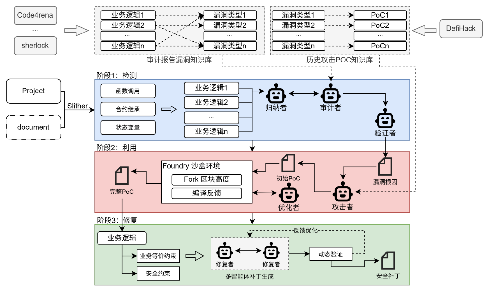

# SCVD Agent

`SCVD Agent` is a lightweight Python prototype for agentic smart-contract vulnerability detection. It combines dual RAG knowledge bases, project/document parsing, business-flow construction, vulnerability reasoning, PoC planning, Foundry sandbox feedback, patch generation, validation planning, and report generation. 

## What it detects

The current prototype covers a deterministic subset of vulnerability classes commonly represented in audit reports and smart-contract auditing skills:

- share-accounting bootstrap and first-depositor attacks
- implicit floor rounding in value-conversion paths
- boundary-state arithmetic over supply / reserve / balance denominators
- repeated-interaction drift in deposit / withdraw / swap style workflows
- unchecked arithmetic inside economic workflows
- scaling / precision mismatch
- cross-function arithmetic drift that later propagates into valuation logic
- spot-price / balance-derived oracle misuse
- missing access control on privileged state mutation
- external interaction before effects are complete
- unsafe ERC20 integration assumptions
- signature replay preconditions
- unbounded loop / push-payment DoS preconditions
- upgradeable proxy initialization risks

## Quick start

```powershell
py -3 -m scvd_agent .\tests\fixtures\vulnerable --out-dir .\reports --prefix bunni_like
```

Request-file mode:

```powershell
py -3 -m scvd_agent --request .\examples\scan_request.example.json
```

Or install it as an editable project:

```powershell
py -3 -m pip install -e .
scvd-agent .\tests\fixtures\vulnerable --out-dir .\reports
```

## Output

The CLI writes two files:

- Markdown report: `reports/<prefix>.md`
- JSON report: `reports/<prefix>.json`

The JSON report is the stable machine-readable output for downstream agents. Its top-level shape is:

- `schema_version`: IO contract version, currently `scvd.multiagent.io.v1`
- `inputs`: normalized resolved `ScanRequest`
- `artifacts`: generated report paths
- `summary`: compact counts by severity, validation status, PoC drafts, and patch plans
- `outputs`: stable grouped outputs for UI/agent consumers
- `working_memory`: full internal trace for advanced downstream agents

Stable grouped outputs:

- `project`: profile, documents, call graph, inheritance graph, business flows, business logic units
- `rag`: retrieved audit-report records and historical attack PoC records
- `analysis`: business constraints, findings, validation results, root causes
- `poc`: PoC drafts and Foundry sandbox feedback
- `patches`: patch candidates, dynamic validation plans, security patch plans

## Tests

```powershell
py -3 -m unittest discover -s tests -v
```

## Architecture



- `ProjectProfilerAgent`: indexes files, languages, state variables, functions
- `CodeStructureAgent`: extracts function-call edges, inheritance edges, and the state surface
- `AuditReportRAGAgent`: retrieves curated audit-report vulnerability knowledge relevant to code and docs
- `AttackPocRAGAgent`: retrieves historical attack PoC patterns for root-cause and exploit planning
- `BusinessFlowGraphAgent`: builds function-level business flow nodes and shared-state edges
- `BusinessLogicExtractionAgent`: creates business logic units from calls, inheritance, and state
- `BusinessCompositionAgent`: maps flows to semantic-vulnerability audit tasks
- `BusinessConstraintValidatorAgent`: checks business constraints against local function facts
- `HotspotExtractionAgent`: keeps arithmetic hotspots with economic relevance
- `WorkflowMapperAgent`: links state writes to later valuation or branch-selection reads
- `HypothesisAgent`: emits structured arithmetic defect hypotheses
- `VulnerabilityReasoningAgent`: promotes violated business constraints to findings
- `RootCauseReasoningAgent`: combines findings with audit and attack-PoC RAG context
- `ReflectionAgent`: deduplicates and consolidates findings
- `ValidationAgent`: records detailed Step 4 validation status, preconditions, false-positive checks, attack paths, and dynamic test follow-ups
- `PocPlanningAgent`, `FoundrySandboxAgent`, `PocFeedbackAgent`: build initial/complete PoC plans and sandbox feedback
- `PatchGenerationAgent`, `PatchDynamicValidationAgent`: generate security patch plans and dynamic validation checks
- `LLMReviewAgent`: optional OpenAI-compatible refinement layer

## Module Layout

- `project_agents.py`: project/document intake plus function-call, inheritance, and state extraction
- `rag_agents.py`: audit-report RAG and historical attack-PoC RAG
- `business_agents.py`: business flow graph, business logic units, composition, and constraint validation
- `reasoning_agents.py`: hotspot mapping, hypothesis generation, vulnerability reasoning, root-cause analysis
- `validation_agents.py`: detailed vulnerability validation
- `poc_agents.py`: initial PoC generation, Foundry sandbox feedback, complete PoC planning
- `patch_agents.py`: patch candidate generation and dynamic validation planning
- `orchestrator.py`: wires the multi-agent workflow together

See `docs/workflow.md` for the full workflow, input/output schema, and API integration.

## Optional LLM API

The scanner is offline by default. To enable the LLM review layer:

```powershell
$env:OPENAI_API_KEY = "sk-..."
py -3 -m scvd_agent .\tests\fixtures\vulnerable --llm --llm-model gpt-4o-mini
```

For other OpenAI-compatible providers:

```powershell
$env:MY_LLM_KEY = "..."
py -3 -m scvd_agent .\contracts --llm --llm-api-key-env MY_LLM_KEY --llm-base-url https://example.com/v1 --llm-model model-name
```

## Not implemented yet

- automatic fuzz harness generation
- stateful sequence synthesis
- fork-based exploit validation

Those steps are left intentionally open so you can plug this detector into a later fuzzing / validation stage.
