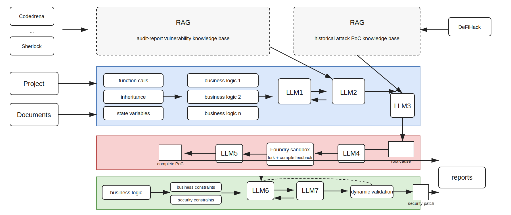
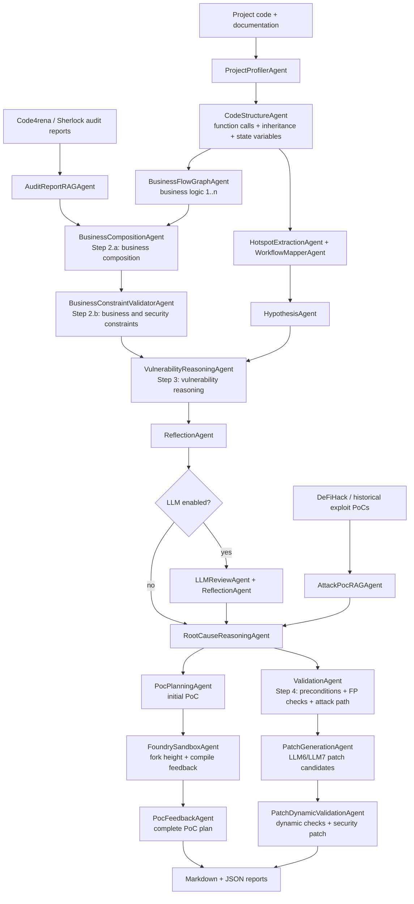
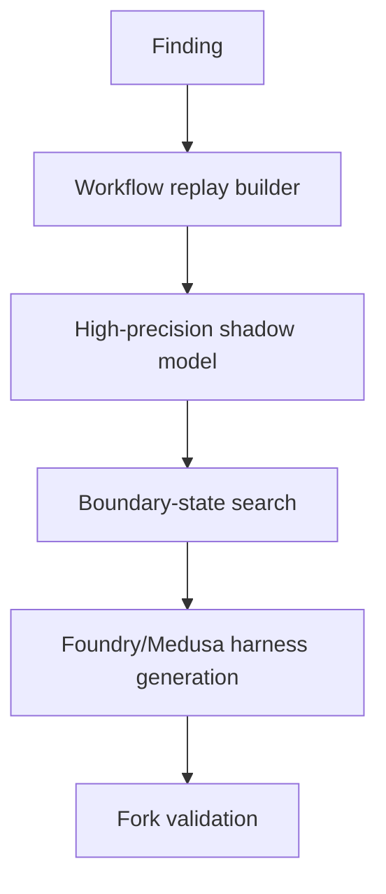

# SCVD Agent Workflow

This document defines the current modular workflow, input/output schema, and optional LLM integration points.

## Paper-style Figure



The editable Mermaid source is stored in `docs/figures/scvd_agent_workflow.mmd`.

## Pipeline



## Input

The scanner accepts either direct CLI arguments or a JSON request.

Minimal CLI:

```powershell
py -3 -m scvd_agent .\tests\fixtures\vulnerable --out-dir .\reports --prefix demo
```

Request JSON:

```json
{
  "target": "../tests/fixtures/vulnerable",
  "out_dir": "../reports",
  "report_prefix": "request_demo",
  "documents": [],
  "scope_files": [],
  "audit_sources": ["code4rena", "sherlock"],
  "attack_sources": ["defihack"],
  "output_formats": ["markdown", "json"],
  "options": {
    "max_hotspots": 30,
    "max_knowledge_records": 6,
    "max_attack_poc_records": 4,
    "include_source_context": true,
    "llm": {
      "enabled": false,
      "provider": "openai_compatible",
      "model": "gpt-4o-mini",
      "api_key_env": "OPENAI_API_KEY",
      "base_url": "https://api.openai.com/v1",
      "temperature": 0.0,
      "max_tokens": 1200
    }
  }
}
```

Run request JSON:

```powershell
py -3 -m scvd_agent --request .\examples\scan_request.example.json
```

## Output

The scanner writes:

- `reports/<prefix>.md`: human-readable audit report
- `reports/<prefix>.json`: full working-memory object for downstream agents

The JSON report includes:

- `schema_version`: stable IO contract version
- `inputs`: normalized resolved request
- `artifacts`: generated report paths
- `summary`: compact counts and status summaries
- `outputs`: stable grouped outputs for downstream agents
- `working_memory`: complete internal trace

- `profile`: project-level metadata
- `documents`: indexed Markdown/RST/text chunks used as project documentation context
- `knowledge_base`: curated audit knowledge records
- `retrieved_knowledge`: RAG-style knowledge matches for the project
- `attack_poc_knowledge_base`: historical DeFiHack-style attack PoC records
- `retrieved_attack_pocs`: attack PoC matches for findings and project context
- `functions`: extracted function facts
- `call_edges`: project function-call edges
- `inheritance_edges`: contract inheritance edges
- `business_flows`: function-level business flow graph nodes
- `business_logic_units`: business logic units derived from calls, inheritance, and state
- `audit_tasks`: semantic-vulnerability tasks created from flow + knowledge composition
- `business_constraints`: validated/satisfied/needs-review constraints
- `root_causes`: root-cause records connected to audit and attack-PoC RAG evidence
- `hotspots`: arithmetic functions selected for later analysis
- `workflow_edges`: state-write to valuation-read edges
- `findings`: consolidated hypotheses with locations and evidence
- `validation_results`: Step 4 validation status per finding, including preconditions, false-positive checks, attack path, next steps, and evidence
- `poc_drafts`: initial and completed PoC plans
- `foundry_results`: Foundry sandbox availability and feedback records
- `patch_candidates`: generated patch candidates preserving business/security constraints
- `dynamic_validation_results`: patch validation checklists
- `security_patches`: final security patch plans
- `notes`: agent execution trace

See `docs/io_contract.md` for the exact request/response contract.

## Where LLMs Are Used

LLM use is optional. The default scanner is deterministic and offline.

Current LLM integration point:

- `LLMReviewAgent`: reviews rule-generated finding candidates, refines titles/summaries, asks for missing evidence, and suggests next validation steps.

Intended future LLM integration points:

- `SemanticSpecAgent`: infer protocol-specific economic invariants from code, docs, and retrieved audit knowledge.
- `HarnessDraftAgent`: draft Foundry/Echidna/Medusa harnesses for a selected workflow.
- `ExploitPlanAgent`: propose transaction templates for repeated tiny interaction and regime-switch exploration.
- `ReportNarrativeAgent`: turn validated witnesses into paper-style case studies.

## API Integration

### LLM API

Enable OpenAI-compatible API calls:

```powershell
$env:OPENAI_API_KEY = "sk-..."
py -3 -m scvd_agent .\tests\fixtures\vulnerable --llm --llm-model gpt-4o-mini
```

Custom provider:

```powershell
$env:MY_LLM_KEY = "..."
py -3 -m scvd_agent .\contracts --llm --llm-api-key-env MY_LLM_KEY --llm-base-url https://example.com/v1 --llm-model model-name
```

### Programmatic API

```python
from scvd_agent.api import scan_contract_project

result = scan_contract_project({
    "target": "tests/fixtures/vulnerable",
    "out_dir": "reports",
    "report_prefix": "api_demo",
    "options": {
        "max_hotspots": 30,
        "max_attack_poc_records": 4,
        "max_knowledge_records": 6,
        "llm": {"enabled": False}
    }
})

print(result["artifacts"])
print(len(result["result"]["findings"]))
```

## Current Validation Boundary

The current implementation stops before actually running fuzzing or fork replay. Findings should be treated as hypotheses unless an external runner consumes the generated validation plan.

`ValidationAgent` now performs detailed Step 4 planning:

- marks business-constraint findings as `static_validated` when they have retrieved knowledge and code evidence
- marks other evidence-backed findings as `needs_dynamic_validation`
- emits preconditions that must hold for exploitability
- emits false-positive checks that should be ruled out before confirmation
- emits an attack / validation path suitable for a Foundry, Medusa, Hardhat, or fork test
- emits next validation steps by vulnerability category

The next engineering step is to add:


